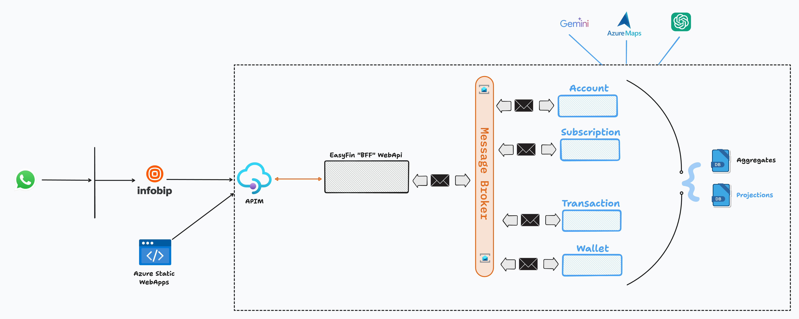

```mermaid
graph TD
    A[<u>**🚩 Aug 5, 2024**</u> <br> Starting a Primitive MVP using Whatsapp Groups] --> B[<u>**🧑🏽‍💻 Aug 5, 2024**</u> <br> First Commit in the Whatsapp WebAPI]
    B --> C[<u>**🔎 Aug 20, 2024**</u> <br> Starting use InfoBip Platform and the First Test Interaction]
    C --> D[<u>**🔬 Aug 21, 2024**</u> <br> First Message in the Test Number]
    D --> E[<u>**💼 Sep 3, 2024**</u> <br> First Task in the GoLive Project]
    E --> F[<u>**✅ Set 26, 2024**</u> <br> Official Number approved by Meta]
    F --> G[<u>**📨 Set 27, 2024**</u> <br> First Message in the Official Number]
    G --> H[<u>**🚀 Oct 9, 2024**</u> <br> First Deploy in the Azure WebApp]
    H --> I[<u>**🎉 Oct 11, 2024**</u> <br> Release v0.1.0]
    I --> J[<u>**🏃🏽 Oct 25, 2024**</u> <br> First Partnership with <a href="https://github.com/raphaelbs">@raphaelbs</a> ]
    J --> K[<u>**🤪 Nov 01, 2024**</u> <br> Finished the First big refactoring ]
```

# Idea
To everyone who needs to organize their digital wallet, EasyFin is a financial registry which helps you to keep track of your money. Better than other solutions like Mobilis, you don't need another app to use EasyFin, you can easily note your buys and see a week or month report just inside WhatsApp, an app everyone already has and uses all the time.

# Features
- Annotate the transaction with:
  - Description
  - Value
  - Type of payment
  - Bank
  - Date (of today is optional, but if it's from another day, put the full date)
- Autoset of transaction category with AI
- Autoset of type category with AI (expense or income)
- Get the report
- Easy register
- Invite someone to use the solution
- Share your wallet with a family member or friend
- Inform your payment type preference (like bank and/or payment method (credit/debit/voucher))
- Visualize/Edit/Delete in a custom web view for each report asked
- Ask for help
- Delete account

      
 <h2>Usage</h2> 

  
1. To start using the solution:
     - Start a conversation in whatsapp with us, you can start with an "hello".
2. Register yourself: 
     - We need to inform just your name (how you like to be called) and your birthday date 
3. Annotate your first purchase, like:
    - Shirt of $30, Nubank by credit card
    - Ice cream  
      $5 debit  
      XP  
      July 04, 2024
4. The solution will process and register your data in the database, it will add the category (using AI) and today's date (if it hasn't been sending)

|  | Exemple 1 | Exemple 2 |
|---|---|---|
| Description | Shirt | Ice cream |
| Value | 30 | 5 |
| Type of payment | credit | debit |
| Bank | Nubank | XP |
| Date | today | 2024-07-04 |
| Category | Clothe | Restaurant |
<!-- https://www.tablesgenerator.com/markdown_tables -->

5. Ask for a report, like: 
     - Show me all my buys of this week
7. Invite, like:
     - Send an invite to [whatsapp number]
9. Share your wallet, like: 
     - Invite my friend [whatsapp number] to my wallet
10. Ask for help:  
     - Just send the word "help"
11. Delete account:  
    - A confirmation message will be shown and you just have to say:
        - "yes" if you really want to delete it, or
        - "no" to cancel the operation and keep using it. 

---

     
 <h2>Architecture</h2> 

     
---

      
 <h2>Our Timeline</h2> 

